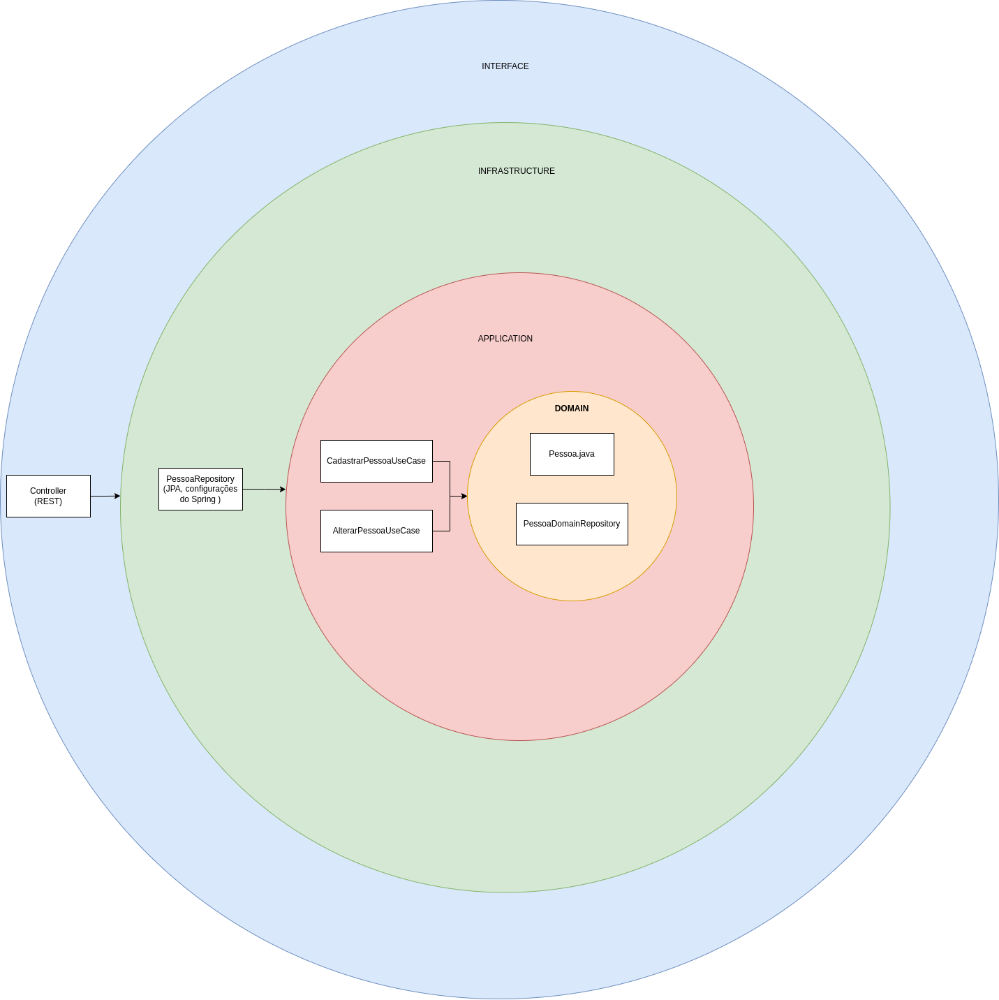

# EXEMPLO DE AQUITETURA CLEAN ARCH COM JAVA 23 E SPRING

Esse projeto foi criado com o intuito de apresentar um modelo simples de aquitetura clean arch e servir de exemplo para criação de novas aplicações.

Veja a imagem de como está feita essa arquitetura:

* [Conceitos de arquitetura clean arch](https://medium.com/@gilvam/clean-architecture-clean-code-ec48a89b0f2b)

