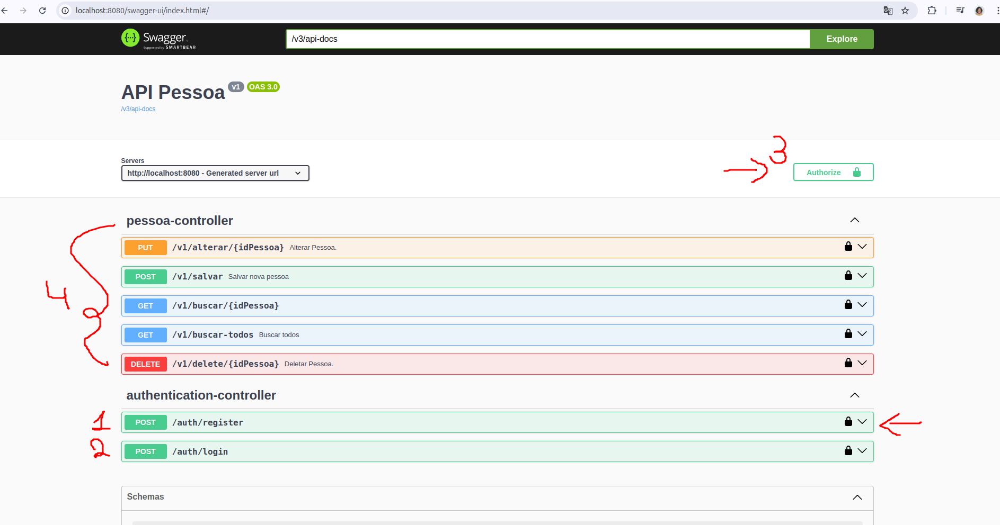
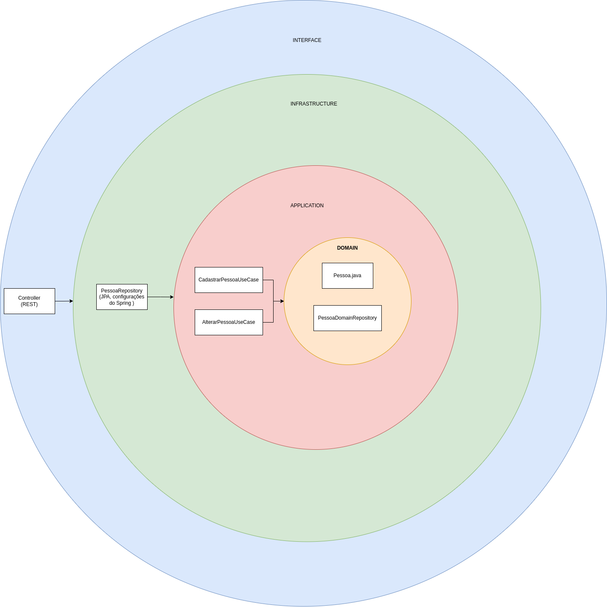

# EXEMPLO DE AQUITETURA CLEAN ARCH COM JAVA 23 E SPRING

Esse projeto foi criado com o intuito de apresentar um modelo simples de aquitetura clean arch e servir de exemplo para criação de novas aplicações.

# Como rodar a aplicação 

A aplicação está dividida em modulos:
- domain - Toda a regra de negocio da aplicação
- application - Aqui estão as usercases e gateway (interfaces)
- infrastructure - Aqui estão as implementações do usercases e as implementações dos gateway
                   Nessa camada já temos os frameworks para implementação:
                   Spring (data, security), H2, Mapstruct, Lombok, Feing, JWT, Jakarta, flyway
- interface - Aqui temos as controllers.
              Nessa camada já temos os frameworks para implementação:
              Spring Web, lombok, Mapstruct, Swagger

Para executar a aplicação e preciso startar a classe Application.java dentro do modulo interface.
Após subir o sistema.

A aplicação utilizar autenticação com Spring security, auth0 e JWT.
Sendo assim para se autenticar você precisa se registrar e logar.
Após o login você recebe um token que precisa colocar na autenticação do swagger
para poder utilizar os serviço 
Segue imagem abaixo:

[Acesso a url: http://localhost:8080/swagger-ui/index.html](http://localhost:8080/swagger-ui/index.html)

A aplicação está dividida em modulos 
 

* [Conceitos de arquitetura clean arch](https://medium.com/@gilvam/clean-architecture-clean-code-ec48a89b0f2b)

Veja a imagem de como está feita essa arquitetura:

